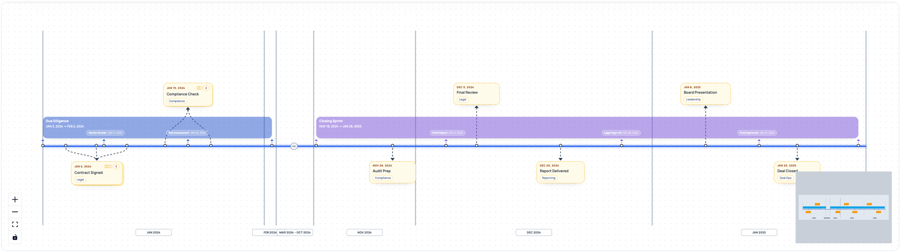

# react-chronoflow

ReactFlow-powered interactive timeline with gap compression, event clustering, duration bands, inline event creation, filtering, and fully customizable nodes.



## Features

- **Gap compression** — large empty periods auto-compress with clickable break markers to expand/collapse
- **Event clustering** — nearby events stack into groups with 6 fan-out layouts (cascade, arc, shelf, staircase, explosion, accordion)
- **Duration bands** — date-range bars with sub-event markers and color-matched edges
- **Inline event creation** — click the axis to add events/bands with a built-in form (title, lane, tags, end date, color picker)
- **Filtering** — built-in filter bar to toggle events by lane, tag, or source
- **Smart placement** — collision-aware card positioning that accounts for band locations per-card
- **Section dividers** — year/month partitions with stagger-aware labels
- **Drag across axis** — edges flip when nodes are dragged to the other side
- **Deletable events** — hover X button on user-created items
- **Self-contained styles** — all inline styles, no Tailwind dependency
- **Fully customizable** — every node accepts render props or full component replacement
- **Headless builder** — use `buildTimelineFlow()` for custom rendering

## Install

```bash
npm install react-chronoflow @xyflow/react
```

## Quick Start

```tsx
import { TimelineFlow } from "react-chronoflow";
import "react-chronoflow/styles.css";
import * as xyflow from "@xyflow/react";
import "@xyflow/react/dist/style.css";

const events = [
  { id: "1", title: "Kickoff", date: "2023-01-15", lane: "Ops", side: "top" },
  { id: "2", title: "Review", date: "2023-06-20", lane: "Eng", side: "bottom" },
  { id: "3", title: "Launch", date: "2024-03-01", lane: "Product", side: "top" },
];

const bands = [
  { id: "b1", title: "Phase 1", start: "2023-01-01", end: "2023-07-01", color: "#2563eb" },
  { id: "b2", title: "Phase 2", start: "2023-07-01", end: "2024-04-01", color: "#8b5cf6" },
];

function App() {
  return (
    <xyflow.ReactFlowProvider>
      <TimelineFlow
        events={events}
        bands={bands}
        xyflow={xyflow}
      />
    </xyflow.ReactFlowProvider>
  );
}
```

## Adding & Deleting Events

Pass `onAddEvent` to enable the click-to-add flow. Pass `onDeleteEvent` to allow removing user-created items.

```tsx
const [events, setEvents] = useState(initialEvents);
const [bands, setBands] = useState(initialBands);

<TimelineFlow
  events={events}
  bands={bands}
  xyflow={xyflow}
  onAddEvent={async (data) => {
    // data: { title, date, endDate?, description?, lane?, tags?, color?, type }
    const saved = await api.createEvent(data);
    if (data.type === "band") {
      setBands(prev => [...prev, { ...saved, source: "user" }]);
    } else {
      setEvents(prev => [...prev, { ...saved, source: "user" }]);
    }
  }}
  onDeleteEvent={async (id) => {
    await api.deleteEvent(id);
    setEvents(prev => prev.filter(e => e.id !== id));
    setBands(prev => prev.filter(b => b.id !== id));
  }}
/>
```

The flow:
1. Click the timeline axis (cursor changes to `+`)
2. Ghost node follows cursor, showing the date at that position
3. Click to place — edit form appears with title, lane, description, tags, optional end date (creates a band), and color picker
4. Confirm — `onAddEvent` fires with all form data
5. Escape or X cancels at any point

Events with `source: "user"` show a delete button (X circle) on hover.

## Filtering

```tsx
<TimelineFlow
  events={events}
  bands={bands}
  xyflow={xyflow}
  showFilters                          // enable the filter bar
  filterCategories={["lane", "tag"]}   // which categories to show (default: all)
  activeFilters={{ lanes: ["Ops"] }}   // controlled mode (optional)
  onFiltersChange={(f) => ...}         // callback when filters change
/>
```

Filter pills toggle on/off. Multiple in same category = OR, across categories = AND. "Clear all" resets.

## Fan-Out Layouts

When events cluster, they stack into a group. Hover to fan out. Six layouts available:

| Layout | Description |
|--------|-------------|
| `"cascade"` | (default) Vertical fan, alternating left/right |
| `"arc"` | Semicircle spreading away from the axis |
| `"shelf"` | Horizontal row to the side |
| `"staircase"` | Diagonal steps |
| `"explosion"` | Radial burst in all directions |
| `"accordion"` | Straight vertical column |

```tsx
<TimelineFlow
  eventStackNodeProps={{
    fanLayout: "arc",
    fanRadius: 150,       // arc/explosion radius (auto-scales if omitted)
    fanStretchX: 1.2,     // horizontal stretch for arc/explosion
    fanStepY: 94,         // vertical step for cascade/accordion/staircase
    fanStepX: 28,         // horizontal step for cascade/staircase/shelf
    fanReverse: true,     // first card on top (good for staircase)
  }}
/>
```

## Props Reference

### Layout

| Prop | Type | Default | Description |
|------|------|---------|-------------|
| `events` | `TimelinePointEvent[]` | required | Point events |
| `bands` | `TimelineBandEvent[]` | `[]` | Duration bands |
| `xyflow` | `typeof import("@xyflow/react")` | required | The xyflow module |
| `maxGapDays` | `number` | `90` | Gaps longer than this get break markers |
| `compressionRatio` | `number` | `0.02` | Compression strength (0 = flat, 1 = none) |
| `clusterGapDays` | `number` | `18` | Events within this window cluster together |
| `sectionGranularity` | `"year" \| "month"` | `"year"` | Section divider granularity |
| `allExpanded` | `boolean` | `false` | Force all gaps expanded |
| `bandSubEvents` | `Record<string, SubEvent[]>` | `{}` | Sub-events inside bands |

### Container & ReactFlow

| Prop | Type | Default | Description |
|------|------|---------|-------------|
| `height` | `string \| number` | `"820px"` | Container height |
| `className` | `string` | -- | Container className |
| `minZoom` / `maxZoom` | `number` | `0.1` / `1.6` | Zoom limits |
| `fitViewPadding` | `number` | `0.12` | Padding for auto-fit |
| `fitViewDuration` | `number` | `400` | Reflow animation duration (ms) |
| `children` | `ReactNode` | -- | Replace default MiniMap/Controls/Background |

### Callbacks

| Prop | Type | Description |
|------|------|-------------|
| `onAddEvent` | `(data) => void` | Called when user confirms adding an event/band |
| `onDeleteEvent` | `(id) => void` | Called when user deletes a user-created item |
| `onToggleGap` | `(gapKey) => void` | Called when a gap break is toggled |
| `onFiltersChange` | `(filters) => void` | Called when filter state changes |

### Filtering

| Prop | Type | Default | Description |
|------|------|---------|-------------|
| `showFilters` | `boolean` | `false` | Show the filter bar |
| `filterCategories` | `Array` | `["lane","tag","source"]` | Which filter categories to show |
| `activeFilters` | `object` | -- | Controlled filter state |

### Node Customization

| Prop | Customizes |
|------|-----------|
| `eventNodeProps` | Single event cards (`className`, `renderContent`) |
| `eventStackNodeProps` | Stacks (`fanLayout`, `fanRadius`, `fanStepY`, etc.) |
| `gapBreakNodeProps` | Break markers (`renderIcon`) |
| `bandNodeProps` | Band bars (`className`, `renderContent`) |
| `markerNodeProps` | Axis dots |
| `axisNodeProps` | Timeline axis line |
| `sectionDividerNodeProps` | Vertical dividers |
| `sectionLabelNodeProps` | Year/month labels (`renderLabel`) |
| `nodeTypes` | Fully replace any node type with a custom component |

## Event Types

```ts
interface TimelinePointEvent {
  id: string;
  title: string;
  date: string | number | Date;
  description?: string;
  lane?: string;
  side?: "top" | "bottom" | "auto";
  color?: string;
  tags?: string[];
  source?: "system" | "user";
  className?: string;
  style?: CSSProperties;
}

interface TimelineBandEvent {
  id: string;
  title: string;
  start: string | number | Date;
  end: string | number | Date;
  lane?: string;
  color?: string;
  tags?: string[];
  source?: "system" | "user";
  className?: string;
  style?: CSSProperties;
}
```

## Headless Usage

Use the layout builder directly for custom rendering:

```tsx
import { buildTimelineFlow } from "react-chronoflow";

const { nodes, edges, gaps, sections, toX, fromX, axisY } = buildTimelineFlow(
  events, bands,
  { maxGapDays: 90, compressionRatio: 0.02, clusterGapDays: 18 },
);

// Feed to your own ReactFlow, or render however you want
```

## CSS

The fan-out animation requires one CSS import:

```tsx
import "react-chronoflow/styles.css";
```

All other styles are inline — no Tailwind config needed.

## Demo

```bash
npm --prefix demo install
npm run build
npm run demo:dev
```

## License

MIT
